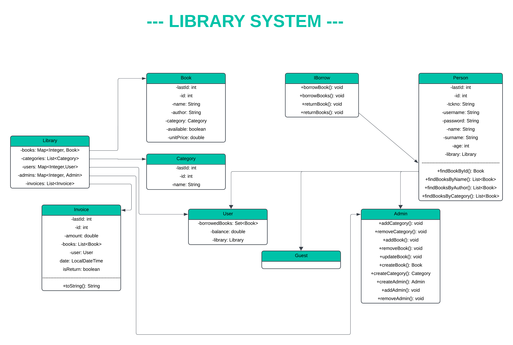

# Library Management System

This project is a management system that performs the core functions of a library. The system provides essential functionalities for efficient management of library resources. It provides different permissions and features for three user types: Guest, Member, and Admin.

🔑 Key Features:
- Book management (add, remove, update, search)
- Category management
- User and admin management
- Book borrowing/return system
- Automated invoice generation
- Balance tracking system

⚙️ Technical Details:
- Object-oriented programming principles (inheritance, encapsulation, polymorphism)
- Interface implementation
- Exception handling
- Collection framework (HashMap, ArrayList, HashSet)
- Clean code practices

## System Features

### Book Management
- ✅ Add new books (Admin)
- ✅ Update book information (Admin)
- ✅ Remove books (Admin)
- ✅ Search books by:
  - ID
  - Name
  - Author
  - Category

### User Types and Permissions
- Guest: Can only search and view books
- Member: Can borrow/return books and manage their account
- Admin: Has full system management privileges

### Borrowing System
- ✅ Borrow books (Member)
- ✅ Return books (Member)
- ✅ Maximum 5 books per user
- ✅ Automated invoice generation for:
  - Borrowing transactions
  - Return transactions

## Initial Setup

The system comes with sample data:
- Basic categories (Fiction, Science, History)
- Sample books
- Test user (ID: 1, Balance: 100) 